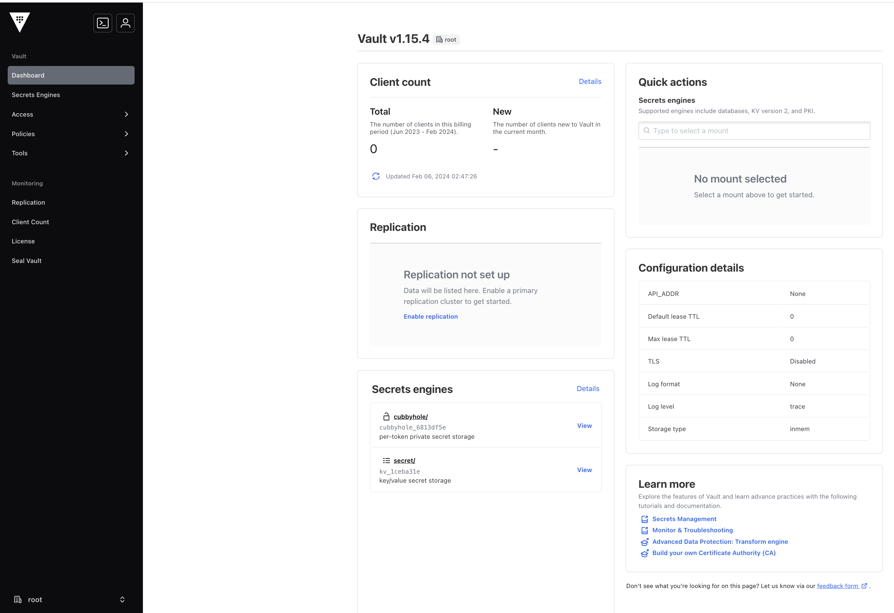
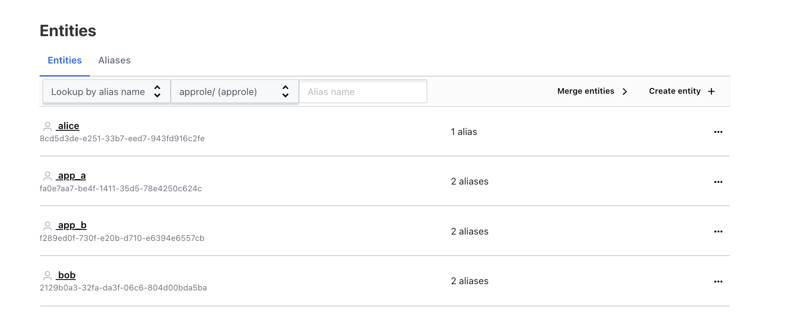
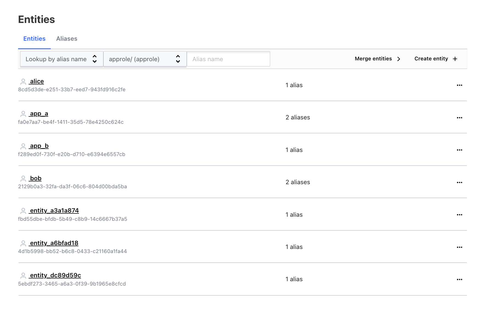
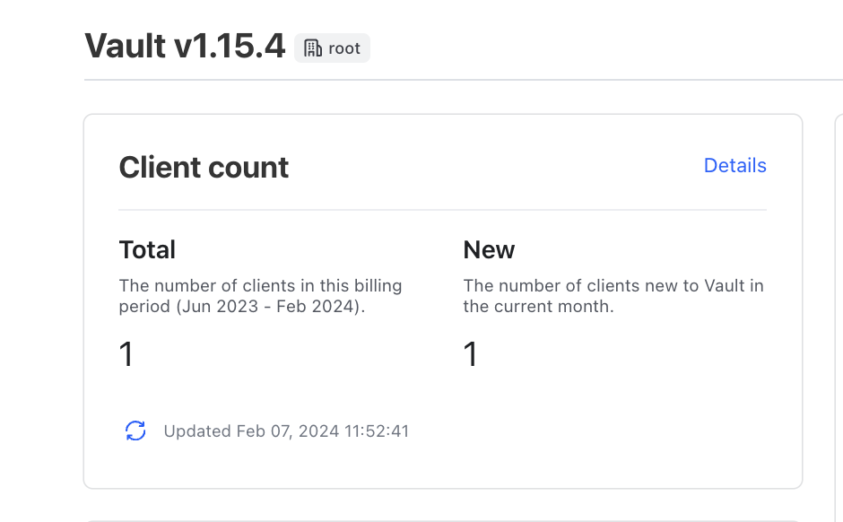
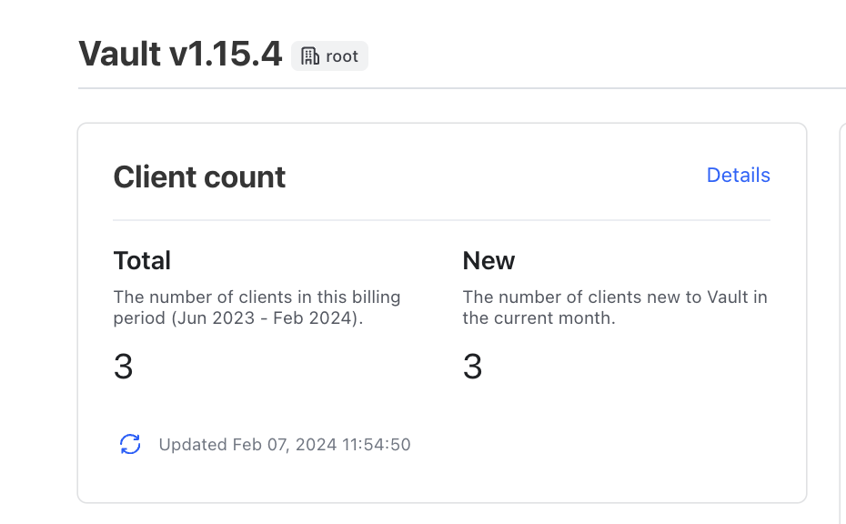

# Vault Clients Lab


### Goal

Vault Clients are the core licensing metrics for Vault Enterprise and HCP Vault. As critical as they are, there's been confusion and lack of practical guidance around understanding how they work in practice. This repo reprsents a sample enviornment with the intention of providing the necessary end-to-end deployment and assets to gain deeper understanding of how clients work. 


### Deployment Scenario

- Vault is deployed in dev mode using Helm chart. Sidecar injector, VSO and an LDAP service are also deployed into the same Kubernets namespace called `vault`. 
- There are two Vault namespaces: Blue and Red
- Human Users: Bob, Alice, Dave have both LDAP and Userpass accounts
- Bob is part of the Blue group, Alice and Dave are part of the Red group
- App A has both k8s and approle roles
- App A uses VSO to retrieve secrets from Vault
- App A and Bob both have access to `kv/app/config` secret in KV secret engine in the Blue namespace via the `blue` policy
- App B has k8s and approle roles and uses sidecar injector service to retrieve secrets from Vault
- App B has access to `kv/app/config` secret in KV secret engine in the Red namespace via the `red` policy
- There are pre-created entities and entity aliases for Bob, Alice, App A and App B

> Note: We're intentionally not creating & associating Alice's userpass alias and we're not creating an entity for Dave to demonstrate how Vault will automatically create it. 


### Lab Overview

This repo provides the needed assets to bootstrap a working lab composed of:

- Vault Enterprise (Single Instance)
    * Vault Namespaces
        - Blue Namespace
        - Red Namepsace
    * Auth Methods & Roles
        - Userpass
        - LDAP
        - Kubernetes
        - AppRole
    * Policies
        - Blue Policy
        - Red Policy
    * Entities  & Aliases

- LDAP Server (SAMBA)
    - Bootstrapped LDAP Server with two groups (Blue and Red) and three users (Alice, Bob, Dave) all with the password `P@ssword1` 
- Vault Secrets Operator (VSO)
- Vault Sidecar Injector
- Kubernetes Namespaces
    - Vault Namespace: used to deloy Vault , VSO, Sidecar Injector, LDAP server
    - Red & Blue Namespaces for Application Deployments
- Kubernetes Application Deployment
    - App A and App B are sample bogus k8s application that uses a secret from Vault to be used to showcase VSO/Sidecar


### Requirements:

- Vault Enterprise License 
- [Docker for Mac/Windows](https://docs.docker.com/desktop/install/mac-install/) with Kubernetes turned on (only tested this on Docker for Mac)
- Terraform CLI
- Vault CLI
- `kubectl` CLI
- [httpie](https://httpie.io/) which is easier/cooler version of `curl`. You can use just curl but need to convert the commands :)


### Deployment Steps

1. Clone this repo into your local environment that has Docker for Mac/Windows running. 

2. Ensure that `kubectl` is correctly configured

```
 $ kubectl get nodes
NAME             STATUS   ROLES           AGE   VERSION
docker-desktop   Ready    control-plane   63d   v1.28.2

 $ kubectl cluster-info     
Kubernetes control plane is running at https://kubernetes.docker.internal:6443
CoreDNS is running at https://kubernetes.docker.internal:6443/api/v1/namespaces/kube-system/services/kube-dns:dns/proxy

To further debug and diagnose cluster problems, use 'kubectl cluster-info dump'.
```

3. Edit the `variables.tf` file and add a valid Vault Enterprise license under the default value.

4. Ensure that your Docker Desktop Kubernetes configs are located in `~/.kube/config` or update the kubernetes provider config in the `providers.tf` file to reflect the actual path for yoru kubernetes config if it's not `~/.kube/config`

5. Initialize Terraform and run Terraform Plan/Apply


```
$ terraform init                

Initializing the backend...

Initializing provider plugins...
- Reusing previous version of hashicorp/vault from the dependency lock file
- Reusing previous version of hashicorp/helm from the dependency lock file
- Reusing previous version of hashicorp/kubernetes from the dependency lock file
- Using previously-installed hashicorp/vault v3.24.0
- Using previously-installed hashicorp/helm v2.12.1
- Using previously-installed hashicorp/kubernetes v2.25.2

Terraform has been successfully initialized!

You may now begin working with Terraform. Try running "terraform plan" to see
any changes that are required for your infrastructure. All Terraform commands
should now work.

If you ever set or change modules or backend configuration for Terraform,
rerun this command to reinitialize your working directory. If you forget, other
commands will detect it and remind you to do so if necessary.


$ terraform apply --auto-approve
...

Apply complete! Resources: 43 added, 0 changed, 0 destroyed.

```

6. It will take a few minutes for the deloyment to finish, once it does you can validate that it deployed successfully

```
$ kubeclt get pod -n vault
NAME                                                            READY   STATUS    RESTARTS   AGE
ldap-6b49f5c885-mkbk9                                           1/1     Running   0          63s
vault-0                                                         1/1     Running   0          61s
vault-agent-injector-559b9646cb-k9ng8                           1/1     Running   0          61s
vso-vault-secrets-operator-controller-manager-9df69fbd5-462cw   2/2     Running   0          53s


$  kubectl get ns    
NAME              STATUS   AGE
blue              Active   2m21s
default           Active   63d
kube-node-lease   Active   63d
kube-public       Active   63d
kube-system       Active   63d
red               Active   2m21s
vault             Active   2m21s

```

7. Now you can access Vault's UI from your local machine browser. On Mac, you can use `http://localhost:30001` and it should take you to Vault's UI. You can login using token method with the token value of `root`. 





You can see that the client count is 0 at this point given that no users/applications have authenticated into Vault. If you go to `Access` tab you can see that we have a number of auth methods configured (**approle, kubernetes,ldap,token,userpass**). All of which are configured under the root namespace.

> Note: Entities are scoped to the Vault namespace. Therefore, it's important to plan ahead and place auth methods in the root (or parent) namespace to be considered as 1 client in all namespaces.

If you go to `Entities` tab, you can see that there are pre-created entities for `Bob`, `Alice`, `app_a` and `app_b`. There are also pre-created entity aliases created and associated with these entities. Note that both `app_a` and `app_b` have a kubernetes alias associated with their entities. 





8. Let's explore Vault's API to check entities/clients. Here i'm using `localhost`, you can alternatively use the kubernetes service IP for Vault that you can get via

```
$ kubectl get svc -n vault          
NAME                                         TYPE        CLUSTER-IP       EXTERNAL-IP   PORT(S)             AGE
ldap                                         ClusterIP   10.108.163.250   <none>        389/TCP,636/TCP     28m
vault                                        ClusterIP   10.107.112.76    <none>        8200/TCP,8201/TCP   28m
vault-agent-injector-svc                     ClusterIP   10.101.134.110   <none>        443/TCP             28m
vault-internal                               ClusterIP   None             <none>        8200/TCP,8201/TCP   28m
vault-ui                                     NodePort    10.104.125.240   <none>        8200:30001/TCP      28m
vso-vault-secrets-operator-metrics-service   ClusterIP   10.102.52.145    <none>        8443/TCP            28m


$ export VAULT_ADDR="http://localhost:8200" # alternatively VAULT_ADDR="http://10.107.112.76:8200"
$ export VAULT_TOKEN="root"
$ export VAULT_NAMESPACE="root"

$ http $VAULT_ADDR/v1/sys/internal/counters/entities "X-Vault-Token: $VAULT_TOKEN"
HTTP/1.1 200 OK
Cache-Control: no-store
Content-Length: 195
Content-Type: application/json
Date: Tue, 06 Feb 2024 21:11:18 GMT
Strict-Transport-Security: max-age=31536000; includeSubDomains

{
    "auth": null,
    "data": {
        "counters": {
            "entities": {
                "total": 4
            }
        }
    },
    "lease_duration": 0,
    "lease_id": "",
    "renewable": false,
    "request_id": "dd07bcb3-f8c1-c3b8-e2cf-4bda7de49bc4",
    "warnings": null,
    "wrap_info": null
}

$ http $VAULT_ADDR/v1/sys/internal/counters/activity "X-Vault-Token: $VAULT_TOKEN" 
HTTP/1.1 200 OK
Cache-Control: no-store
Content-Length: 367
Content-Type: application/json
Date: Tue, 06 Feb 2024 21:12:44 GMT
Strict-Transport-Security: max-age=31536000; includeSubDomains

{
    "auth": null,
    "data": {
        "by_namespace": [],
        "end_time": "2024-01-31T23:59:59Z",
        "months": [],
        "start_time": "2023-02-01T00:00:00Z",
        "total": {
            "clients": 0,
            "distinct_entities": 0,
            "entity_clients": 0,
            "non_entity_clients": 0,
            "non_entity_tokens": 0
        }
    },
    "lease_duration": 0,
    "lease_id": "",
    "renewable": false,
    "request_id": "3d9a8a3a-b8cc-c8f4-3c15-daa8a5dc4b61",
    "warnings": null,
    "wrap_info": null
}

$ http $VAULT_ADDR/v1/sys/internal/counters/activity/monthly "X-Vault-Token: $VAULT_TOKEN" 

HTTP/1.1 200 OK
Cache-Control: no-store
Content-Length: 287
Content-Type: application/json
Date: Tue, 06 Feb 2024 21:49:05 GMT
Strict-Transport-Security: max-age=31536000; includeSubDomains

{
    "auth": null,
    "data": {
        "by_namespace": [],
        "clients": 0,
        "distinct_entities": 0,
        "entity_clients": 0,
        "months": [],
        "non_entity_clients": 0,
        "non_entity_tokens": 0
    },
    "lease_duration": 0,
    "lease_id": "",
    "renewable": false,
    "request_id": "21f889b3-79a3-06f1-0f5b-ca0b21593de2",
    "warnings": null,
    "wrap_info": null
}

```


9. At this point, we have all the required configurations so we can start testing creating clients. You can uncomment the `login.tf` configs, which would emulate Bob & Alice authenticating into Vault using the `userpass` auth method. Dave authenticating using `userpass` method. It will also emulate authenticating `approle_a` and `approle_b` into Vault's approle auth method. 


```
$ terraform apply --auto-approve

...

Apply complete! Resources: 8 added, 0 changed, 0 destroyed.

Outputs:

alice_entity_lookup_id = "5ebdf273-3465-a6a3-0f39-9b1965e8cfcd"
alice_pre_created_entity_id = "8cd5d3de-e251-33b7-eed7-943fd916c2fe"
bob_entity_lookup_id = "2129b0a3-32fa-da3f-06c6-804d00bda5ba"
bob_pre_created_entity_id = "2129b0a3-32fa-da3f-06c6-804d00bda5ba"
dave_entity_lookup_id = "fbd55dbe-bfdb-5b49-c8b9-14c6667b37a5"
```

Let's make a few observations here:
-  First, you can see from the Terraform output that Bob's pre created entity ID matches the entity ID associated with the token (`2129b0a3-32fa-da3f-06c6-804d00bda5ba`) while that's not the case for Alice. This is due to the fact that we never created or associated a userpass alias to Alice's entity. So we should expect Alice to be able to authenticate, but Vault wouldn't recognize it as having an exisiting entity and therefore it will create a new entity for it (see below)



- Second, from Vault's portal, and under the entities dashboard, you can see that both `app_a` and `app_b` have 2 aliases each representing `k8s` and `approle` auth methods. Therefore, authenticating using approle did not create a new entity or entity alias for `app_b`. 


- Third, we see a newly created entity *and* entity alias for Dave with an entity alias named `Dave`. Given that we never created an entity for Dave, nor did we create an alias. Vault created both an entity and associated alias for Dave. 

- Finally, notice anything interesting about the client count (below) ? It's still saying there are zero clients. This is because clients are only incremented/created upon successful API request post-authentication (e.g getting secrets, loading the UI, writing secrets..etc). Therefore, the process of authentication into Vault by itself doesn't increment client count. Authenticating into Vault creates entities/entity aliases, but subsequent authenticated API calls using the token will create the client


10. Let's prove that out! If you open a new Vault window, and login using Bob's LDAP credentials (username=`Bob`, password=`P@ssword1`) then you'll see the client count increment by 1.




11. Now let's shift to Kubernetes. We will be deploying two applications `app-a` and `app-b` as kubernetes deployments into the `blue` and `red` k8s namespaces respectively. `app-a` will leverage VSO to retrieve secrets from Vault and `app-b` will use sidecar injection to retrieve secrets from Vault. 

> Optional: You can view the vault raw audit logging to get more detailed logs when k8s apps authenticate into Vault. You can do that by opening a new terminal and running these commands:
```
$ kubectl exec -it vault-0 -n vault -- /bin/sh
/ $ tail -f /tmp/vault.log
...
```


Now let's deploy `app-a` first:

```
$  kubectl apply -f app-a.yml -n blue                       
deployment.apps/app-a created
vaultstaticsecret.secrets.hashicorp.com/vault-kv-app created

$ kubectl get pod -n blue                 
NAME                     READY   STATUS    RESTARTS   AGE
app-a-5bdb596b48-87qh7   1/1     Running   0          11s

$ kubectl get secret -n blue                        
NAME           TYPE     DATA   AGE
vault-kv-app   Opaque   3      27s
```

If you see that the application is in the `Running` state, that means it was able to successfully create the secret object from Vault using VSO. Let's check the client count:

```
$ http $VAULT_ADDR/v1/sys/internal/counters/activity/monthly "X-Vault-Token: $VAULT_TOKEN" 
HTTP/1.1 200 OK
Cache-Control: no-store
Content-Length: 1918
Content-Type: application/json
Date: Tue, 06 Feb 2024 22:45:17 GMT
Strict-Transport-Security: max-age=31536000; includeSubDomains

{
    "auth": null,
    "data": {
        "by_namespace": [
            {
                "counts": {
                    "clients": 2,
                    "distinct_entities": 2,
                    "entity_clients": 2,
                    "non_entity_clients": 0,
                    "non_entity_tokens": 0
                },
                "mounts": [
                    {
                        "counts": {
                            "clients": 1,
                            "distinct_entities": 1,
                            "entity_clients": 1,
                            "non_entity_clients": 0,
                            "non_entity_tokens": 0
                        },
                        "mount_path": "auth/kubernetes/"
                    },
                    {
                        "counts": {
                            "clients": 1,
                            "distinct_entities": 1,
                            "entity_clients": 1,
                            "non_entity_clients": 0,
                            "non_entity_tokens": 0
                        },
                        "mount_path": "auth/ldap/"
                    }
                ],
                "namespace_id": "root",
                "namespace_path": ""
            }
        ],
        "clients": 2,
        "distinct_entities": 2,
        "entity_clients": 2,
        "months": [
            {
                "counts": {
                    "clients": 2,
                    "distinct_entities": 0,
                    "entity_clients": 2,
                    "non_entity_clients": 0,
                    "non_entity_tokens": 0
                },
                "namespaces": [
                    {
                        "counts": {
                            "clients": 2,
                            "distinct_entities": 0,
                            "entity_clients": 2,
                            "non_entity_clients": 0,
                            "non_entity_tokens": 0
                        },
                        "mounts": [
                            {
                                "counts": {
                                    "clients": 1,
                                    "distinct_entities": 0,
                                    "entity_clients": 1,
                                    "non_entity_clients": 0,
                                    "non_entity_tokens": 0
                                },
                                "mount_path": "auth/kubernetes/"
                            },
                            {
                                "counts": {
                                    "clients": 1,
                                    "distinct_entities": 0,
                                    "entity_clients": 1,
                                    "non_entity_clients": 0,
                                    "non_entity_tokens": 0
                                },
                                "mount_path": "auth/ldap/"
                            }
                        ],
                        "namespace_id": "root",
                        "namespace_path": ""
                    }
                ],
                "new_clients": {
                    "counts": {
                        "clients": 2,
                        "distinct_entities": 0,
                        "entity_clients": 2,
                        "non_entity_clients": 0,
                        "non_entity_tokens": 0
                    },
                    "namespaces": [
                        {
                            "counts": {
                                "clients": 2,
                                "distinct_entities": 0,
                                "entity_clients": 2,
                                "non_entity_clients": 0,
                                "non_entity_tokens": 0
                            },
                            "mounts": [
                                {
                                    "counts": {
                                        "clients": 1,
                                        "distinct_entities": 0,
                                        "entity_clients": 1,
                                        "non_entity_clients": 0,
                                        "non_entity_tokens": 0
                                    },
                                    "mount_path": "auth/ldap/"
                                },
                                {
                                    "counts": {
                                        "clients": 1,
                                        "distinct_entities": 0,
                                        "entity_clients": 1,
                                        "non_entity_clients": 0,
                                        "non_entity_tokens": 0
                                    },
                                    "mount_path": "auth/kubernetes/"
                                }
                            ],
                            "namespace_id": "root",
                            "namespace_path": ""
                        }
                    ]
                },
                "timestamp": "2024-02-01T00:00:00Z"
            }
        ],
        "non_entity_clients": 0,
        "non_entity_tokens": 0
    },
    "lease_duration": 0,
    "lease_id": "",
    "renewable": false,
    "request_id": "0b6f6332-6720-890c-e1a3-887fa74ca663",
    "warnings": null,
    "wrap_info": null
}
```

You can see that there are two clients now. The newly added k8s client after `app_a` was deloyed and VSO used its k8s auth to retrieve a secret on its behalf.  We can also see an audit log entry with very detailed log of the auth request. Particularly, you can see service account details that were used when matching this pod to the exisiting `app_a` entity and `entity_alias`. Because of that, Vault will not create any new entities or entity aliases. It will recognize the exisiting ones and associate this pod (via its service account name in this case) to the exisiting entity and entity alias. 

```
{
    "time": "2024-02-06T22:54:08.533531546Z",
    "type": "response",
    "auth": {
        "client_token": "hvs.CAESIDURx6dp0Kle4uj3mjY9oo0tEycPBTqBRUwo7RfHq8ITGh4KHGh2cy5ib2U1VGhhc3BsTXV3bVNTbWx1MVFsWTQ",
        "accessor": "cZzpCmk5kteeJG3gMxOwUXPt",
        "display_name": "kubernetes-blue-default",
        "policies": [
            "blue",
            "default"
        ],
        "token_policies": [
            "blue",
            "default"
        ],
        "identity_policies": [
            "blue"
        ],
        "policy_results": {
            "allowed": true,
            "granting_policies": [
                {
                    "name": "blue",
                    "namespace_id": "root",
                    "type": "acl"
                }
            ]
        },
        "metadata": {
            "role": "app_a",
            "service_account_name": "default",
            "service_account_namespace": "blue",
            "service_account_secret_name": "",
            "service_account_uid": "e82bfa59-3b9e-44c6-af98-c95c24294206"
        },
        "entity_id": "fa0e7aa7-be4f-1411-35d5-78e4250c624c",
        "token_type": "service",
        "token_ttl": 3600,
        "token_issue_time": "2024-02-06T22:41:54Z"
    },
    "request": {
        "id": "58c46b56-c60c-3de2-e39f-82a85b80ac8d",
        "client_id": "fa0e7aa7-be4f-1411-35d5-78e4250c624c",
        "operation": "read",
        "mount_point": "blue/kv/",
        "mount_type": "kv",
        "mount_accessor": "kv_0046b77f",
        "mount_running_version": "v0.16.1+builtin",
        "mount_class": "secret",
        "client_token": "hvs.boe5ThasplMuwmSSmlu1QlY4",
        "client_token_accessor": "cZzpCmk5kteeJG3gMxOwUXPt",
        "namespace": {
            "id": "MDDzG",
            "path": "blue/"
        },
        "path": "kv/data/app/config",
        "remote_address": "10.1.2.41",
        "remote_port": 36972
    },
    "response": {
        "mount_point": "blue/kv/",
        "mount_type": "kv",
        "mount_accessor": "kv_0046b77f",
        "mount_running_plugin_version": "v0.16.1+builtin",
        "mount_class": "secret",
        "data": {
            "data": {
                "password": "blue",
                "username": "demo"
            },
            "metadata": {
                "created_time": "2024-02-06T20:40:59.022089458Z",
                "custom_metadata": null,
                "deletion_time": "",
                "destroyed": false,
                "version": 1
            }
        }
    }
}
```

12. Now let's deploy `app-b`:

```
$ kubectl apply -f app-b.yml -n red 
deployment.apps/app-b created

$  kubectl get pod -n red           
NAME                     READY   STATUS    RESTARTS   AGE
app-b-586f7fddb8-6kpsk   2/2     Running   0          7s

```

Checking again the client count:



```
 http $VAULT_ADDR/v1/sys/internal/counters/activity/monthly "X-Vault-Token: $VAULT_TOKEN" 
HTTP/1.1 200 OK
Cache-Control: no-store
Content-Length: 1918
Content-Type: application/json
Date: Tue, 06 Feb 2024 22:56:08 GMT
Strict-Transport-Security: max-age=31536000; includeSubDomains

{
    "auth": null,
    "data": {
        "by_namespace": [
            {
                "counts": {
                    "clients": 3,
                    "distinct_entities": 3,
                    "entity_clients": 3,
                    "non_entity_clients": 0,
                    "non_entity_tokens": 0
                },
                "mounts": [
                    {
                        "counts": {
                            "clients": 2,
                            "distinct_entities": 2,
                            "entity_clients": 2,
                            "non_entity_clients": 0,
                            "non_entity_tokens": 0
                        },
                        "mount_path": "auth/kubernetes/"
                    },
                    {
                        "counts": {
                            "clients": 1,
                            "distinct_entities": 1,
                            "entity_clients": 1,
                            "non_entity_clients": 0,
                            "non_entity_tokens": 0
                        },
                        "mount_path": "auth/ldap/"
                    }
                ],
                "namespace_id": "root",
                "namespace_path": ""
            }
        ],
        "clients": 3,
        "distinct_entities": 3,
        "entity_clients": 3,
        "months": [
            {
                "counts": {
                    "clients": 3,
                    "distinct_entities": 0,
                    "entity_clients": 3,
                    "non_entity_clients": 0,
                    "non_entity_tokens": 0
                },
                "namespaces": [
                    {
                        "counts": {
                            "clients": 3,
                            "distinct_entities": 0,
                            "entity_clients": 3,
                            "non_entity_clients": 0,
                            "non_entity_tokens": 0
                        },
                        "mounts": [
                            {
                                "counts": {
                                    "clients": 2,
                                    "distinct_entities": 0,
                                    "entity_clients": 2,
                                    "non_entity_clients": 0,
                                    "non_entity_tokens": 0
                                },
                                "mount_path": "auth/kubernetes/"
                            },
                            {
                                "counts": {
                                    "clients": 1,
                                    "distinct_entities": 0,
                                    "entity_clients": 1,
                                    "non_entity_clients": 0,
                                    "non_entity_tokens": 0
                                },
                                "mount_path": "auth/ldap/"
                            }
                        ],
                        "namespace_id": "root",
                        "namespace_path": ""
                    }
                ],
                "new_clients": {
                    "counts": {
                        "clients": 3,
                        "distinct_entities": 0,
                        "entity_clients": 3,
                        "non_entity_clients": 0,
                        "non_entity_tokens": 0
                    },
                    "namespaces": [
                        {
                            "counts": {
                                "clients": 3,
                                "distinct_entities": 0,
                                "entity_clients": 3,
                                "non_entity_clients": 0,
                                "non_entity_tokens": 0
                            },
                            "mounts": [
                                {
                                    "counts": {
                                        "clients": 2,
                                        "distinct_entities": 0,
                                        "entity_clients": 2,
                                        "non_entity_clients": 0,
                                        "non_entity_tokens": 0
                                    },
                                    "mount_path": "auth/kubernetes/"
                                },
                                {
                                    "counts": {
                                        "clients": 1,
                                        "distinct_entities": 0,
                                        "entity_clients": 1,
                                        "non_entity_clients": 0,
                                        "non_entity_tokens": 0
                                    },
                                    "mount_path": "auth/ldap/"
                                }
                            ],
                            "namespace_id": "root",
                            "namespace_path": ""
                        }
                    ]
                },
                "timestamp": "2024-02-01T00:00:00Z"
            }
        ],
        "non_entity_clients": 0,
        "non_entity_tokens": 0
    },
    "lease_duration": 0,
    "lease_id": "",
    "renewable": false,
    "request_id": "b66532c2-19b9-9ff3-99c0-0b9203567782",
    "warnings": null,
    "wrap_info": null
}
```

Similarily, we have a detailed audit log to show us the auth request details:

```
{
    "time": "2024-02-06T22:51:52.620840761Z",
    "type": "response",
    "auth": {
        "client_token": "hvs.CAESIFDxMf_RjFOzrMSFQ4JzxRd_4m3MRXC98iS9eJN9m7R8Gh4KHGh2cy5YZDE0bldBb09zTjkwNmsyRUNkZEpDdFk",
        "accessor": "pUXUzKeYxrXDjWY3J0x4qcR0",
        "display_name": "kubernetes-red-default",
        "policies": [
            "default",
            "red"
        ],
        "token_policies": [
            "default",
            "red"
        ],
        "identity_policies": [
            "red"
        ],
        "policy_results": {
            "allowed": true,
            "granting_policies": [
                {
                    "name": "red",
                    "namespace_id": "root",
                    "type": "acl"
                }
            ]
        },
        "metadata": {
            "role": "app_b",
            "service_account_name": "default",
            "service_account_namespace": "red",
            "service_account_secret_name": "",
            "service_account_uid": "6164b857-e659-4498-a0eb-fddc463a9a57"
        },
        "entity_id": "f289ed0f-730f-e20b-d710-e6394e6557cb",
        "token_type": "service",
        "token_ttl": 3600,
        "token_issue_time": "2024-02-06T22:51:52Z"
    },
    "request": {
        "id": "575f77e8-43f6-9728-444b-b1c7b57aa1be",
        "client_id": "f289ed0f-730f-e20b-d710-e6394e6557cb",
        "operation": "read",
        "mount_point": "red/kv/",
        "mount_type": "kv",
        "mount_accessor": "kv_3e9bf025",
        "mount_running_version": "v0.16.1+builtin",
        "mount_class": "secret",
        "client_token": "hvs.Xd14nWAoOsN906k2ECddJCtY",
        "client_token_accessor": "pUXUzKeYxrXDjWY3J0x4qcR0",
        "namespace": {
            "id": "5Ejcb",
            "path": "red/"
        },
        "path": "kv/data/app/config",
        "remote_address": "10.1.2.45",
        "remote_port": 60490
    },
    "response": {
        "mount_point": "red/kv/",
        "mount_type": "kv",
        "mount_accessor": "kv_3e9bf025",
        "mount_running_plugin_version": "v0.16.1+builtin",
        "mount_class": "secret",
        "data": {
            "data": {
                "password": "red",
                "username": "demo"
            },
            "metadata": {
                "created_time": "2024-02-06T20:40:58.997091208Z",
                "custom_metadata": null,
                "deletion_time": "",
                "destroyed": false,
                "version": 1
            }
        }
    }
}
```

### Conclusion

Understanding how entities, entity aliases and clients work in Vault is critical for both deploying a secure secret management solution AND ensuring a well-planned and predictible licensing consumption model. Although this lab showcases a few auth methods, secret engines..etc The concepts are univeral within Vault and can be extended to demonstrate other scenarios. Here are a few tips to consider:

- Clients are unique applications, services, and/or users that authenticate to a HashiCorp Vault cluster. More details in this [What is a Vault Client](https://developer.hashicorp.com/hcp/docs/vault/client#authentication-methods-and-how-they-re-counted-in-vault) article. 
- Entities and Clients are not one and the same. You can have many entities and zero clients. 
- Clients are created upon successful API actions post-authentication ( UI login, retrieving secrets). They are counted once per billing period no matter how many times the client uses Vault. 
- Entities can either be implicitly created by Vault when users/services successfully authenticate into Vault OR they can be explicitly pre-created via Vault API/Terraform provider..etc.
- It's recommended to pre-create entities and entity aliases explicitly to ensure predictable and accurate client count. 
- Entities and entity aliases are scoped to the Vault namespace. You can not associate entity aliases from different namespaces into an entity in local namespace.
- If a client authenticates to Vault in a parent or root namespaces, it is considered the same client in all child namespaces. This is obvious as it is within the same logical isolation. Place that auth in the root namespace to be considered as 1 client in all namespaces. 
- Entities can have 0 or more entity aliases. 
- Entities can have only have 1 entity alias from the same auth *mount*
- Entities can have any number of entity aliases from different auth mounts of the same *auth method*
- Entity aliases need to be named appropriately based on the [following Auth Method/Name mapping](https://developer.hashicorp.com/hcp/docs/vault/client#authentication-methods-and-how-they-re-counted-in-vault)
- Entities are global in a performance-replicated multi Vault Enterprise cluster deployments. Clients, however, are only local to the cluster. 


### Some Helpful Vault API Endpoints 

```

$ http $VAULT_ADDR/v1/sys/internal/counters/entities "X-Vault-Token: $VAULT_TOKEN"

  # Returns details on the total number of entities 

$ http $VAULT_ADDR/v1/sys/internal/counters/tokens "X-Vault-Token: $VAULT_TOKEN"

  # Returns details on the total number of tokens

$ http $VAULT_ADDR/v1/sys/internal/counters/activity "X-Vault-Token: $VAULT_TOKEN" 

  # Returns total client count breakdown by auth method by namespace and new clients by month

$ http $VAULT_ADDR/v1/sys/internal/counters/activity/export "X-Vault-Token: $VAULT_TOKEN" 

  # Returns a list of unique clients that had activity within the provided start/end time 

$ http $VAULT_ADDR/v1/sys/internal/counters/activity/monthly "X-Vault-Token: $VAULT_TOKEN" 

 # Returns client activity for the current month 
```

### Teardown


```
$ kubectl delete -f app-a.yml -n blue
$ kubectl delete -f app-b.yml -n red
$ terraform destroy --auto-approve
```


